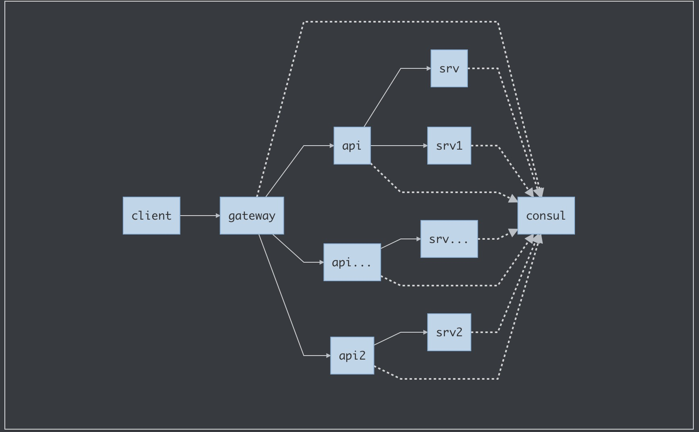

# pepsi

gin+grpc+consul实现的微服务demo:购物模块

### 整体架构

- **consul** 服务注册发现中心
- **gateway** 对外网关服务，将用户的请求分发到对应的api服务上
- **api** 接口服务层，将请求处理的业务分发到不同的srv中进行处理，然后进行数据整合返回给客户端
- **srv** 接口具体实现服务

### 业务流程

### 启动方式

consul:

    consul agent -dev

gateway:

    go run example/gateway/gin/gin.go

api:
   
    go run example/api/buy/buy.go 

srv:

    go run example/srv/goods/goods.go 
    go run example/srv/order/order.go 
    
test:

    curl http://127.0.0.1:8080/shopping/v1/buyGoods -X POST -H "Content-Type:application/json" -d '{"userID":89757,"goodsInfos":[{"goodsID":1,"count":2},{"goodsID":2,"count":3}]}'

### plan

* [x] 基于grpc的方式实现consul的服务注册与发现 
* [ ] 基于构建好的服务注册发现编写购物demo
    * [x] 实现简单的购物demo
        * [ ] 商品处理数据需要持久化
        * [ ] 生成订单处理数据需要持久化
    * [x] 增加本地限流与熔断保护机制
    * [X] 封装成docker镜像
    * [x] 增加分布式链路追踪jaeger
    * [ ] 日志系统
        * [ ] zap/logrus
    * [ ] 增加持久化存储商品，缓存
        * [ ] tidb/mysql(mycat)/mongo
        * [ ] redis/memcache
    * [ ] 限流与熔断保护数据可动态配置调整
    * [ ] 部署到k8s