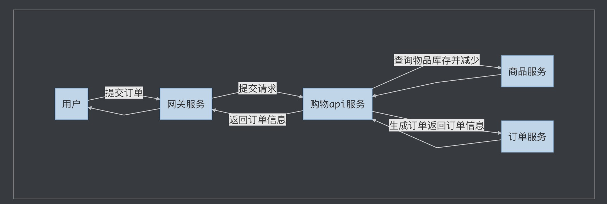

# pepsi

gin+grpc+consul实现的微服务demo:购物模块

### 业务流程

### 启动方式

consul:

    consul agent -dev

gateway:

    go run example/gateway/gin/gin.go

api:
   
    go run example/api/buy/buy.go 

srv:

    go run example/srv/goods/goods.go 
    go run example/srv/order/order.go 
    
test:

    curl http://127.0.0.1:8080/shopping/v1/buyGoods -X POST -H "Content-Type:application/json" -d '{"userID":89757,"goodsInfos":[{"goodsID":1,"count":2},{"goodsID":2,"count":3}]}'
 